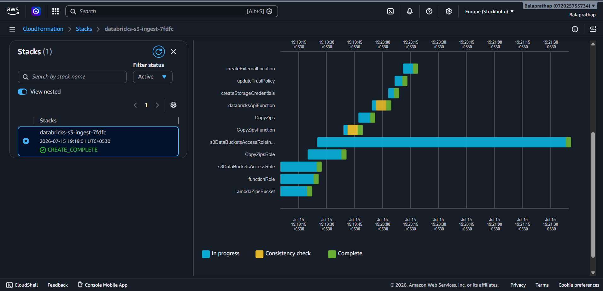
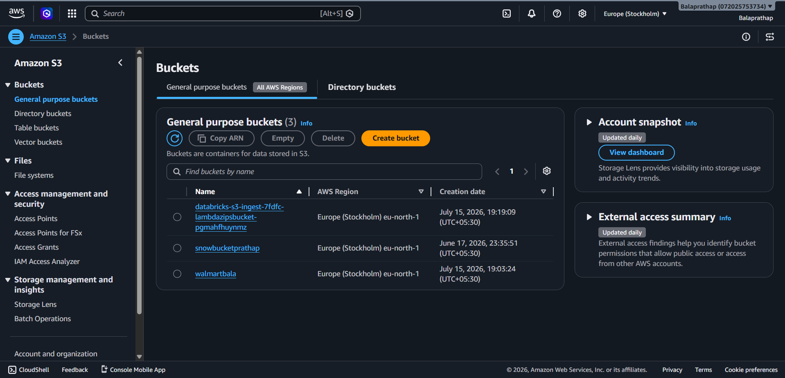
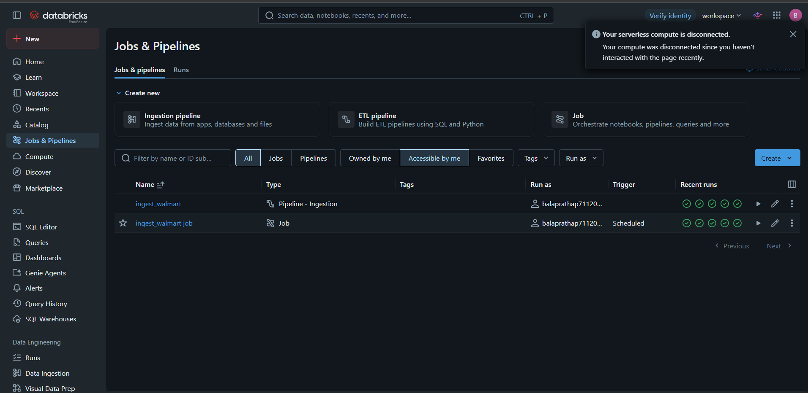
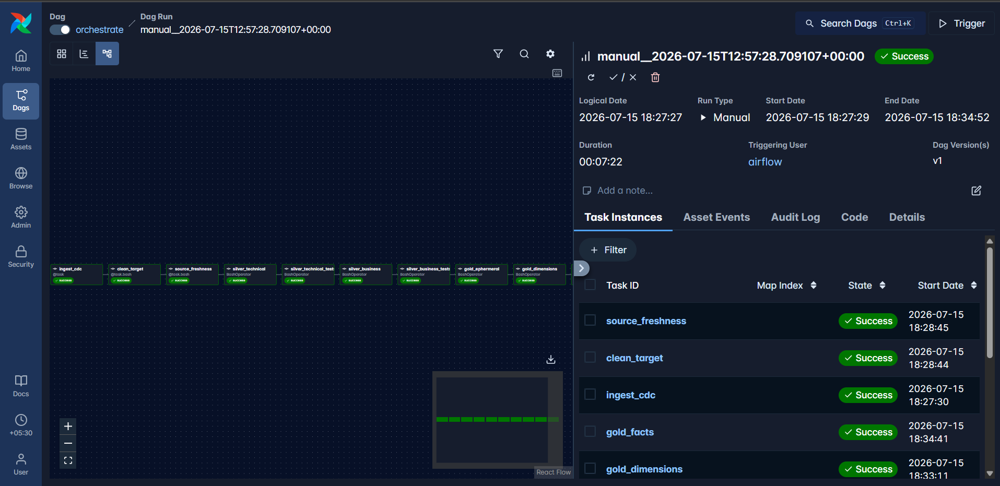
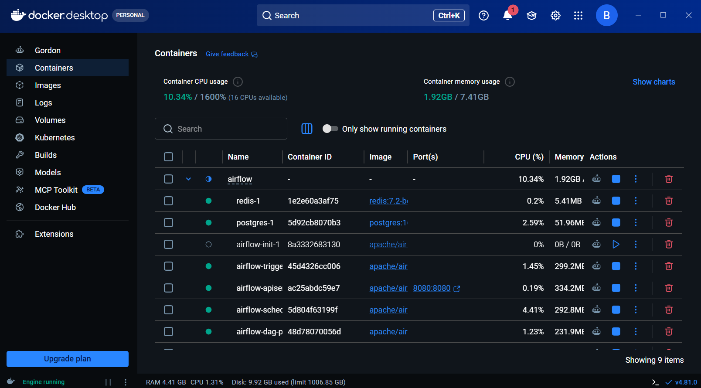

# 🚀 Walmart End-to-End Data Engineering Pipeline
### Airflow + Databricks + dbt + AWS S3 + Unity Catalog

An end-to-end modern Data Engineering project demonstrating how to orchestrate an enterprise ETL pipeline using **Apache Airflow**, **Databricks**, **dbt**, **AWS S3**, and **Unity Catalog**.

This project simulates a production-grade data platform where raw data is ingested into AWS S3, processed in Databricks using the Medallion Architecture, transformed with dbt, validated through automated quality checks, and orchestrated end-to-end using Apache Airflow.

---

# 📌 Project Architecture

<p align="center">

</p>

---

# 🚀 Tech Stack

| Category | Technology |
|-----------|------------|
| Orchestration | Apache Airflow 3 |
| Transformation | dbt |
| Data Platform | Databricks |
| Cloud Storage | AWS S3 |
| Data Catalog | Unity Catalog |
| Data Warehouse | Databricks SQL Warehouse |
| Containerization | Docker |
| Programming | Python |
| SQL Engine | Databricks SQL |
| Version Control | Git & GitHub |

---

# 📂 Project Structure

```text
.
│
├── airflow/
│   ├── dags/
│   ├── plugins/
│   ├── config/
│   ├── logs/
│   └── docker-compose.yaml
│
├── walmart_project/
│   ├── models/
│   │   ├── silver_t/
│   │   ├── silver_b/
│   │   ├── gold/
│   │   └── sources.yml
│   │
│   ├── snapshots/
│   ├── macros/
│   ├── tests/
│   ├── analyses/
│   └── dbt_project.yml
│
├── Dockerfile
├── requirements.txt
└── README.md
```

---

# ⚙️ Pipeline Flow

The Airflow DAG performs the following tasks:

```
Databricks Job
        │
        ▼
Clean dbt Target
        │
        ▼
Source Freshness Check
        │
        ▼
Silver Technical Models
        │
        ▼
Technical Tests
        │
        ▼
Silver Business Models
        │
        ▼
Business Tests
        │
        ▼
Gold Ephemeral Models
        │
        ▼
dbt Snapshots (Dimensions)
        │
        ▼
Gold Fact Models
```

---

# 🏗 Medallion Architecture

## Bronze

- Raw incremental ingestion
- CDC Data
- AWS S3 Landing

---

## Silver Technical

- Type conversions
- Cleaning
- Null handling
- Deduplication

---

## Silver Business

- Business rules
- Calculated columns
- Data standardization

---

## Gold

### Dimension Tables

- Customers
- Employees
- Products
- Orders
- Stores

using

- dbt Snapshots
- Slowly Changing Dimensions (SCD Type 2)

### Fact Tables

Business-ready analytical models.

---

# 📊 dbt Features Used

✅ Sources

✅ Source Freshness

✅ Incremental Models

✅ Ephemeral Models

✅ Snapshots

✅ Generic Tests

- Unique

- Not Null

- Accepted Values

✅ Documentation

✅ Lineage

---

# 🔄 Apache Airflow

The DAG automatically orchestrates the complete ELT pipeline.

Features:

- Databricks Job Trigger
- Job Monitoring
- dbt Commands
- Sequential Dependencies
- Failure Handling
- Logging

---

# ☁ AWS Infrastructure

Infrastructure deployed using CloudFormation.

Resources include:

- S3 Bucket
- IAM Roles
- Storage Credentials
- External Location
- Unity Catalog Integration

---

# 📸 Screenshots

## AWS CloudFormation



---

## AWS S3 Bucket



---

## Databricks Jobs



---


## Apache Airflow DAG and Successful Execution



---

## Docker Containers



---

## Overall Architecture


---

# 🧪 Data Quality

The project validates data using dbt tests.

Implemented:

- Unique Keys
- Not Null Checks
- Source Freshness
- Snapshot Validation

---

# 🔄 Slowly Changing Dimensions

Implemented using dbt Snapshots.

Tables:

- dim_customers
- dim_products
- dim_orders
- dim_employees
- dim_stores

---

# 🐳 Docker

All services run inside Docker containers.

Containers:

- Airflow Scheduler
- Airflow Worker
- Airflow Triggerer
- Airflow API Server
- Airflow DAG Processor
- PostgreSQL
- Redis

---

# 📈 Pipeline Features

✔ Automated orchestration

✔ Incremental loading

✔ CDC processing

✔ Snapshot dimensions

✔ Data quality testing

✔ Medallion architecture

✔ Enterprise folder structure

✔ Dockerized deployment

✔ Databricks SQL Warehouse

✔ Unity Catalog

✔ AWS S3 integration

---

# 🚀 Future Improvements

- Great Expectations Integration
- Slack Notifications
- Email Alerts
- CI/CD with GitHub Actions
- Terraform Deployment
- Azure Support
- Snowflake Support
- Data Observability
- OpenLineage

---

# 👨‍💻 Author

**Bala Prathap**

MS Computer & Information Science

Florida Atlantic University

GitHub:
https://github.com/Balaprathap

LinkedIn:
https://www.linkedin.com/in/bala-prathap-30502817a/

---

# ⭐ If you found this project useful, please give it a Star!
